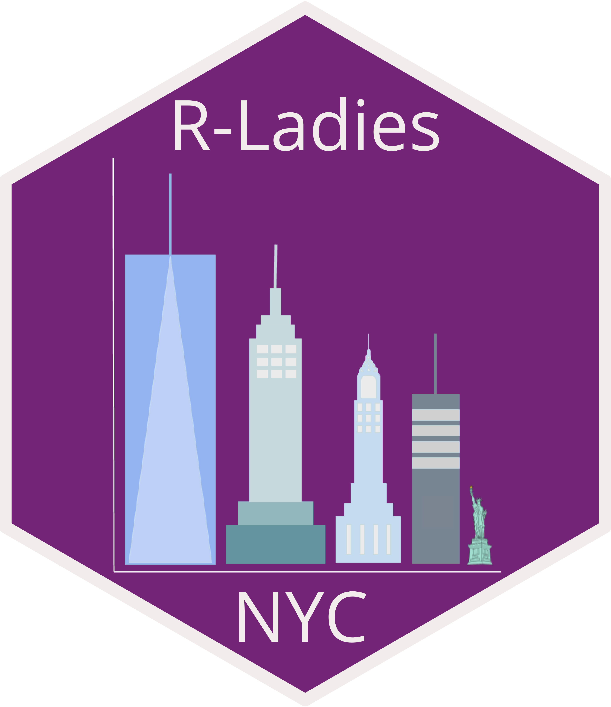

```{r setup, include=FALSE}
options(htmltools.dir.version = FALSE)
# remotes::install_github("rladies/meetupr")
set.seed(424)
library(readr)
library(meetupr)
library(purrr)
library(dplyr)
library(tidyr)
library(stringr)
library(lubridate)
library(ggplot2)
library(ggrepel)
library(tm)
library(wordcloud)
library(ggmap)
```

```{r include=FALSE}
# https://www.fontsquirrel.com/fonts/open-sans
# library(extrafont)
# font_import()
# loadfonts()
```


```{r include=FALSE}
# data
events <- read_rds(here::here("data/events.rds"))
members <- read_rds(here::here("data/members.rds"))
```


```{r include=FALSE}
theme_rladies <- function () { 
  font = "OpenSans"
  theme_minimal() %+replace% 
    theme(
      panel.grid.minor = element_blank(),    
      axis.ticks = element_blank(),          
      plot.title = element_text(             
                   family = font,            
                   size = 20,                
                   face = 'bold',            
                   hjust = 0,                
                   vjust = 2),               
      plot.subtitle = element_text(         
                   family = font,           
                   size = 14),              
      plot.caption = element_text(         
                   family = font,          
                   size = 9,               
                   hjust = 1),             
      axis.title = element_text(           
                   family = font,          
                   size = 10),             
      axis.text = element_text(            
                   family = font,          
                   size = 9),              
      axis.text.x = element_text(          
                    margin = margin(5, b = 10))
    )
}

```



---

# WHAT IS THIS TALK?

--

- An in-depth look at the R-Ladies NYC meetup data

--

- An attempt to quantify our existence

--

- A look at the code that used to do this (and possibly using some fun functions that might be new to you)


---

# Getting data from our meetup page using meetupr

```{r}
urlname <- "rladies-newyork"
# events <- get_events(urlname, "past")
# events <- write_rds(events, here::here("data/events.rds")

glimpse(events)
```


---

# Event RSVP Counts on Average?

```{r}
summary(events$yes_rsvp_count)
```


---

# Are our RSVP counts trending upwards?

```{r eval=FALSE}
ggplot(events, aes(local_date, yes_rsvp_count)) + 
  geom_line(color = "#88398a") +
  geom_point(color = "#88398a", size = 2) + 
  labs(x = "Date", y = "RSVP Count") + 
  theme_rladies()
```

--- 

# Are our RSVP counts trending upwards?

```{r echo=FALSE}
ggplot(events, aes(local_date, yes_rsvp_count)) + 
  geom_line(color = "#88398a") +
  geom_point(color = "#88398a", size = 2) + 
  labs(x = "Date", y = "RSVP Count") + 
  theme_rladies()
```


---

# What are those low RSVP count events?

```{r eval=FALSE}
events_low_labels <- events %>% 
  mutate(name = ifelse(yes_rsvp_count > 35, "", name), 
         name = str_remove(name, "R-ladies"), 
         name = str_remove(name, "R-Ladies"),
         name = str_remove(name, "R Ladies"))

ggplot(events_low_labels, aes(local_date, yes_rsvp_count, label = name)) + 
  geom_line(color = "#88398a") +
  geom_point(color = "#88398a", size = 2) + 
  geom_label_repel(size = 2.5, force = 5, nudge_y = 5, segment.color = "grey60") + 
  labs(x = "Date", y = "RSVP Count") + 
  theme_rladies()
```

---

# What are those low RSVP count events?

```{r echo=FALSE}
events_low_labels <- events %>% 
  mutate(name = ifelse(yes_rsvp_count > 35, "", name), 
         name = str_remove(name, "R-ladies"), 
         name = str_remove(name, "R-Ladies"),
         name = str_remove(name, "R Ladies"))

ggplot(events_low_labels, aes(local_date, yes_rsvp_count, label = name)) + 
  geom_line(color = "#88398a") +
  geom_point(color = "#88398a", size = 2) + 
  geom_label_repel(size = 2.5, force = 5, nudge_y = 5, segment.color = "grey60") + 
  labs(x = "Date", y = "RSVP Count") + 
  theme_rladies()
```


---

# Filter out expectedly small events

```{r}
events_normal <- events %>% 
  filter(!str_detect(name, "Book Club"), 
         !str_detect(name, "book club"), 
         !str_detect(name, "Social"), 
         !str_detect(name, "Workshop")) 
```

```{r}
summary(events_normal$yes_rsvp_count)
```


---

# Trending Up?

```{r eval=FALSE}
ggplot(events_normal, aes(local_date, yes_rsvp_count)) + 
  geom_line(color = "#88398a") +
  geom_point(color = "#88398a", size = 2) + 
  labs(x = "Date", y = "RSVP Count") + 
  theme_rladies()
```


---

# Trending Up?

```{r echo=FALSE}
ggplot(events_normal, aes(local_date, yes_rsvp_count)) + 
  geom_line(color = "#88398a") +
  geom_point(color = "#88398a", size = 2) + 
  labs(x = "Date", y = "RSVP Count") + 
  theme_rladies()
```

---

# What were those "popular" events?

```{r eval=FALSE}
events_normal_labels <- events_normal %>% 
  mutate(name = ifelse(yes_rsvp_count < 80, "", name))
ggplot(events_normal_labels, aes(local_date, yes_rsvp_count, label = name)) + 
  geom_col(fill = "#88398a") +
  geom_label_repel(size = 2.5, force = 5, nudge_y = -5, segment.color = "grey60") + 
  labs(x = "Date", y = "RSVP Count") + 
  theme_rladies()
```


---

# What were those "popular" events?

```{r echo=FALSE}
events_normal_labels <- events_normal %>% 
  mutate(name = ifelse(yes_rsvp_count < 80, "", name))
ggplot(events_normal_labels, aes(local_date, yes_rsvp_count, label = name)) + 
  geom_col(fill = "#88398a") +
  geom_label_repel(size = 2.5, force = 5, nudge_y = -5, segment.color = "grey60") + 
  labs(x = "Date", y = "RSVP Count") + 
  theme_rladies()
```

---

# Look at members data 

```{r}
# members <- get_members(urlname)
# members <- write_rds(members, here::here("data/members.rds"))

glimpse(members)
```

---

Count of new members by month

```{r eval=FALSE}
members_month <- members %>% 
  mutate(year_month = as.Date(floor_date(created, "month"))) %>% 
  group_by(year_month) %>% 
  summarise(count_new_members = n()) 

ggplot(members_month, aes(year_month, count_new_members)) + 
  geom_col() + 
  scale_x_date(date_breaks = '6 months', date_labels = '%Y-%m') +
  theme_rladies() 
```


---

Count of new members by month

```{r echo=FALSE}
members_month <- members %>% 
  mutate(year_month = as.Date(floor_date(created, "month"))) %>% 
  group_by(year_month) %>% 
  summarise(count_new_members = n()) 

ggplot(members_month, aes(year_month, count_new_members)) + 
  geom_col() + 
  scale_x_date(date_breaks = '6 months', date_labels = '%Y-%m') +
  theme_rladies() 
```


---

# Get new members by nearest upcoming event
 
```{r}
# group by day and get count of new accounts 
new_members <- members %>% 
  mutate(date = as.Date(created)) %>% 
  group_by(date) %>% 
  summarise(count_new_members = n()) %>% 
  complete(date = seq.Date(min(date), max(date), by = "day")) # get all the days

# make event dataset to merge with
events_dates <- events %>% 
  select(date = local_date, name) 


members_events_count <- left_join(new_members, events_dates, by = "date") %>%
  mutate(event_flag = ifelse(!is.na(name), 1, 0), 
         event_group = cumsum(event_flag) - event_flag) %>% 
  group_by(event_group) %>% 
  summarise(new_members = sum(count_new_members, na.rm = TRUE))

members_events_groups <- left_join(new_members, events_dates, by = "date") %>% 
  mutate(event_flag = ifelse(!is.na(name), 1, 0), 
         event_group = cumsum(event_flag) - event_flag) %>% 
  filter(!is.na(name)) %>% 
  distinct(event_group, name, date)

members_events <- left_join(members_events_groups, 
                            members_events_count, by = "event_group") %>% 
  mutate(name = ifelse(new_members < 50, "", name))
```


---

# New members by Nearest Upcoming Event

```{r eval=FALSE}
ggplot(members_events, aes(date, new_members, label = name)) + 
  geom_col() + 
  geom_label_repel(size = 2.5, force = 5, nudge_y = 10, segment.color = "grey60") + 
  labs(x = NULL, y = "New Member Count", 
       title = "Count of New Members Prior to Each Event") +
  theme_rladies() 
```


---

# New members by Nearest Upcoming Event

```{r echo=FALSE}
ggplot(members_events, aes(date, new_members, label = name)) + 
  geom_col() + 
  geom_label_repel(size = 2.5, force = 5, nudge_y = 10, segment.color = "grey60") + 
  labs(x = NULL, y = "New Member Count", 
       title = "Count of New Members Prior to Each Event") +
  theme_rladies() 
```


--- 

# Hadley Wickham Bump?

```{r eval=FALSE}
members_events <- left_join(members_events_groups, 
                            members_events_count, by = "event_group") %>% 
  mutate(name = 
           ifelse(name == "Tidy evaluation: Programming with ggplot2 and dplyr", 
                  name, ""))

ggplot(members_events, aes(date, new_members, label = name)) + 
  geom_col() + 
  geom_label_repel(size = 2.5, force = 5, nudge_y = 10, segment.color = "grey60") + 
  labs(x = NULL, y = "New Member Count", 
       title = "Count of New Members Prior to Each Event") +
  theme_rladies() 
```


--- 

# Hadley Wickham Bump?

```{r echo=FALSE}
members_events <- left_join(members_events_groups, 
                            members_events_count, by = "event_group") %>% 
  mutate(name = 
           ifelse(name == "Tidy evaluation: Programming with ggplot2 and dplyr", 
                  name, ""))

ggplot(members_events, aes(date, new_members, label = name)) + 
  geom_col() + 
  geom_label_repel(size = 2.5, force = 5, nudge_y = 10, segment.color = "grey60") + 
  labs(x = NULL, y = "New Member Count", 
       title = "Count of New Members Prior to Each Event") +
  theme_rladies() 
```


---

# Member counts with events 

```{r eval=FALSE}
members_events_all_days <- left_join(new_members, events_dates, by = "date") %>% 
  mutate(event_flag = factor(ifelse(!is.na(name), 1, 0)), 
         count_new_members = ifelse(is.na(count_new_members), 0, count_new_members), 
         year = year(date))

ggplot(members_events_all_days, aes(date, count_new_members, fill = event_flag)) + 
  geom_col() + 
  facet_wrap(~year, scales = "free") +
  scale_fill_manual(values = c("#D3D3D3", "#88398a")) +
  labs(x = NULL, y = "New Member Count") +
  theme_rladies() 
```

---

# Member counts with events 

```{r echo=FALSE}
members_events_all_days <- left_join(new_members, events_dates, by = "date") %>% 
  mutate(event_flag = factor(ifelse(!is.na(name), 1, 0)), 
         count_new_members = ifelse(is.na(count_new_members), 0, count_new_members), 
         year = year(date))

ggplot(members_events_all_days, aes(date, count_new_members, fill = event_flag)) + 
  geom_col() + 
  facet_wrap(~year, scales = "free") +
  scale_fill_manual(values = c("#D3D3D3", "#88398a")) +
  labs(x = NULL, y = "New Member Count") +
  theme_rladies() 
```


--- 

# Hadley Wickham Bump?

```{r eval=FALSE}
members_events <- left_join(members_events_groups, 
                            members_events_count, by = "event_group") %>% 
  mutate(name = 
           ifelse(name == "Tidy evaluation: Programming with ggplot2 and dplyr", 
                  name, ""))

ggplot(members_events, aes(date, new_members, label = name)) + 
  geom_col() + 
  geom_label_repel(size = 2.5, force = 5, nudge_y = 10, segment.color = "grey60") + 
  labs(x = NULL, y = "New Member Count", 
       title = "Count of New Members Prior to Each Event") +
  theme_rladies() 
```


--- 

# Hadley Wickham Bump?

```{r echo=FALSE}
members_events <- left_join(members_events_groups, 
                            members_events_count, by = "event_group") %>% 
  mutate(name = 
           ifelse(name == "Tidy evaluation: Programming with ggplot2 and dplyr", 
                  name, ""))

ggplot(members_events, aes(date, new_members, label = name)) + 
  geom_col() + 
  geom_label_repel(size = 2.5, force = 5, nudge_y = 10, segment.color = "grey60") + 
  labs(x = NULL, y = "New Member Count", 
       title = "Count of New Members Prior to Each Event") +
  theme_rladies() 
```


---

Map of Event Locations


---

Word Cloud

```{r, echo=FALSE, warning=FALSE, out.width = '800px'}
# http://www.sthda.com/english/wiki/text-mining-and-word-cloud-fundamentals-in-r-5-simple-steps-you-should-know
e3 <- events %>% 
  mutate(description = str_remove_all(description, "R-Ladies"),
         description = str_remove_all(description, "R-ladies"),
         description = str_remove_all(description, "Rladies"),
         description = str_remove_all(description, "New York"),
         description = str_remove_all(description, "NYC"),
         description = str_remove_all(description, "Online event"),
         description = str_remove_all(description, "Book Club"), 
         description = str_remove_all(description, "book club"), 
         description = str_remove_all(description, "Workshop"), 
         description = str_remove_all(description, "ladies"))
text <- e3$description
text <- gsub("[[:punct:]]|[[:digit:]]", "", text)
docs <- Corpus(VectorSource(text))
toSpace <- content_transformer(function (x , pattern ) gsub(pattern, " ", x))
# Convert the text to lower case
docs <- tm_map(docs, content_transformer(tolower))
# Remove english common stopwords
docs <- tm_map(docs, removeWords, stopwords("english"))
# specify your stopwords as a character vector
docs <- tm_map(docs, removeWords, c("and", "with", "the", "will", 
                                    "event", "can", "using", 
                                    "she", "for", "from", "not", "how", 
                                    "please", "also", "use", "talk", "pwe", 
                                    "want", "email", "twitter", "phd", "well", 
                                    "columbia", "university", "kaelen", "emily", 
                                    "erin", "elizabeth")) 
docs <- tm_map(docs, stripWhitespace)
dtm <- TermDocumentMatrix(docs)
m <- as.matrix(dtm)
v <- sort(rowSums(m),decreasing=TRUE)
d <- data.frame(word = names(v),freq=v)

wordcloud(words = d$word, freq = d$freq, min.freq = 1,
          max.words = 200, random.order = FALSE, rot.per = 0.35, 
          colors = brewer.pal(10, "Paired"))
```

---